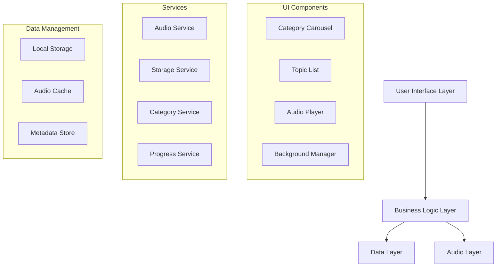

# Design Document

## Overview

The Audio Topics Mobile App is a cross-platform mobile application built using React Native that provides users with an immersive audio listening experience. The app features a category-based content organization system, professional audio playback controls, and an aesthetically pleasing interface with background imagery. The architecture prioritizes performance, offline capability, and seamless audio playback across different device states.

## Architecture

### High-Level Architecture



### Technology Stack

- **Framework**: React Native (cross-platform compatibility)
- **Audio Engine**: react-native-track-player (robust audio playback with background support)
- **State Management**: Redux Toolkit (predictable state management)
- **Storage**: AsyncStorage + MMKV (fast local storage)
- **Navigation**: React Navigation 6 (stack and tab navigation)
- **Background Images**: react-native-fast-image (optimized image loading)
- **Audio Focus**: Native audio session management

## Components and Interfaces

### Core Components

#### 1. CategoryScreen Component
- **Purpose**: Display available topic categories with visual appeal
- **Props**: categories, onCategorySelect, backgroundImage
- **State**: selectedCategory, loading
- **Key Features**:
  - Grid or carousel layout for categories
  - Background image overlay with proper contrast
  - Loading states and error handling

#### 2. TopicListScreen Component
- **Purpose**: Show audio topics within selected category
- **Props**: categoryId, topics, onTopicSelect
- **State**: topics, playbackProgress, completedTopics
- **Key Features**:
  - List view with topic metadata
  - Progress indicators for partially played topics
  - Completion status visualization

#### 3. AudioPlayerScreen Component
- **Purpose**: Main audio playback interface
- **Props**: currentTopic, playlist, backgroundImage
- **State**: playbackState, currentTime, duration, volume
- **Key Features**:
  - Full-screen player with background imagery
  - Professional audio controls (play/pause, seek, volume)
  - Progress bar with time display
  - Topic information display

#### 4. MiniPlayer Component
- **Purpose**: Persistent mini player for background playback
- **Props**: currentTopic, playbackState
- **Key Features**:
  - Compact controls overlay
  - Expandable to full player
  - Always visible during playback

### Service Interfaces

#### AudioService Interface
```typescript
interface AudioService {
  loadTrack(topic: AudioTopic): Promise<void>;
  play(): Promise<void>;
  pause(): Promise<void>;
  seekTo(position: number): Promise<void>;
  setVolume(volume: number): Promise<void>;
  getCurrentPosition(): Promise<number>;
  getDuration(): Promise<number>;
  setupBackgroundMode(): void;
  handleAudioInterruptions(): void;
}
```

#### StorageService Interface
```typescript
interface StorageService {
  saveProgress(topicId: string, position: number): Promise<void>;
  getProgress(topicId: string): Promise<number>;
  markCompleted(topicId: string): Promise<void>;
  getCompletedTopics(): Promise<string[]>;
  saveCategoryPreferences(preferences: CategoryPreferences): Promise<void>;
}
```

## Data Models

### AudioTopic Model
```typescript
interface AudioTopic {
  id: string;
  title: string;
  description: string;
  categoryId: string;
  audioUrl: string;
  duration: number;
  author?: string;
  publishDate?: Date;
  thumbnailUrl?: string;
  metadata: {
    bitrate: number;
    format: string;
    size: number;
  };
}
```

### Category Model
```typescript
interface Category {
  id: string;
  name: string;
  description: string;
  iconUrl?: string;
  backgroundImageUrl?: string;
  topicCount: number;
  color: string;
}
```

### PlaybackState Model
```typescript
interface PlaybackState {
  isPlaying: boolean;
  currentTopic: AudioTopic | null;
  currentPosition: number;
  duration: number;
  volume: number;
  playbackRate: number;
  isLoading: boolean;
  error: string | null;
}
```

### ProgressData Model
```typescript
interface ProgressData {
  topicId: string;
  position: number;
  completed: boolean;
  lastPlayed: Date;
  playCount: number;
}
```

## Error Handling

### Audio Playback Errors
- **Network Errors**: Implement retry logic with exponential backoff
- **Format Errors**: Provide user-friendly error messages and fallback options
- **Device Errors**: Handle audio focus conflicts and hardware limitations

### Storage Errors
- **Quota Exceeded**: Implement cache cleanup strategies
- **Permission Denied**: Request necessary permissions with clear explanations
- **Corruption**: Implement data validation and recovery mechanisms

### Network Errors
- **Connection Lost**: Enable offline mode with cached content
- **Slow Connection**: Implement progressive loading and quality adjustment
- **Server Errors**: Provide retry mechanisms and offline alternatives

### Error Recovery Strategies
1. **Graceful Degradation**: App continues functioning with reduced features
2. **User Feedback**: Clear error messages with actionable solutions
3. **Automatic Recovery**: Silent retry for transient errors
4. **Logging**: Comprehensive error logging for debugging

## Testing Strategy

### Unit Testing
- **Components**: Test rendering, props handling, and user interactions
- **Services**: Test audio operations, storage operations, and error scenarios
- **Utilities**: Test helper functions and data transformations
- **Redux**: Test actions, reducers, and selectors

### Integration Testing
- **Audio Flow**: Test complete playback scenarios from topic selection to completion
- **Navigation**: Test screen transitions and state persistence
- **Background Mode**: Test audio continuation during app backgrounding
- **Interruption Handling**: Test phone calls and other audio app interactions

### End-to-End Testing
- **User Journeys**: Test complete user workflows from app launch to audio completion
- **Device Testing**: Test across different devices, orientations, and OS versions
- **Performance Testing**: Test audio loading times and memory usage
- **Accessibility Testing**: Test screen reader compatibility and touch targets

### Testing Tools
- **Jest**: Unit and integration testing framework
- **React Native Testing Library**: Component testing utilities
- **Detox**: End-to-end testing framework
- **Flipper**: Debugging and performance monitoring

## Performance Considerations

### Audio Optimization
- **Preloading**: Intelligent preloading of next topics in playlist
- **Caching**: Local caching of frequently accessed audio files
- **Compression**: Adaptive bitrate based on network conditions
- **Memory Management**: Proper cleanup of audio resources

### UI Performance
- **Image Optimization**: Lazy loading and caching of background images
- **List Virtualization**: Efficient rendering of large topic lists
- **Animation Performance**: Use native driver for smooth animations
- **Bundle Optimization**: Code splitting and lazy loading of screens

### Battery Optimization
- **Background Processing**: Minimize background CPU usage
- **Network Efficiency**: Batch network requests and use efficient protocols
- **Screen Management**: Proper handling of screen wake locks during playback

## Security Considerations

### Data Protection
- **Local Storage Encryption**: Encrypt sensitive user data and preferences
- **Audio URL Security**: Implement secure audio streaming with token-based authentication
- **User Privacy**: Minimize data collection and provide clear privacy controls

### Content Security
- **Audio Validation**: Validate audio file integrity and format
- **URL Sanitization**: Prevent malicious URL injection
- **Content Filtering**: Implement content validation for user safety